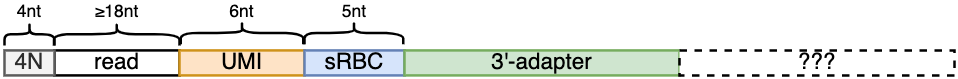
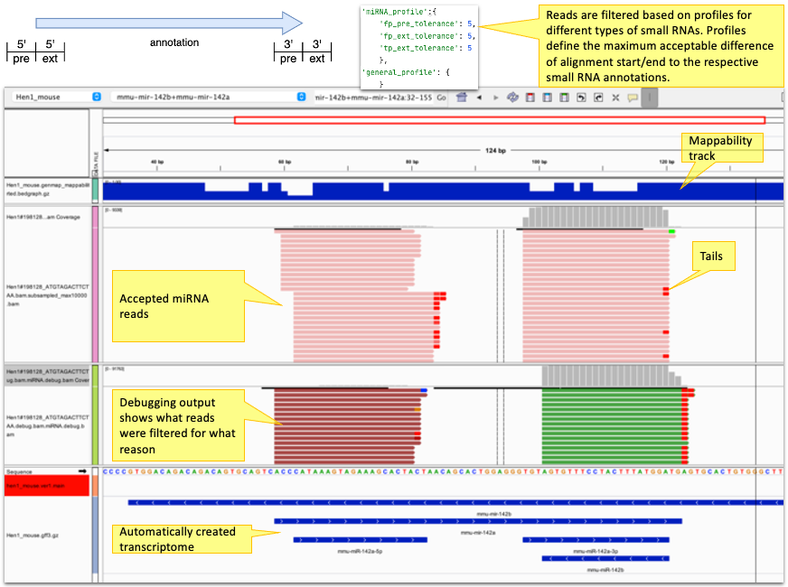

# pysrna  
  
*pysrna* is a python based analysis pipeline for small RNA-seq data. 

  
Contents  
========  
 * [Overview](#overview)  
 * [Installation](#installation)  
 * [Usage](#usage)  
 * [Results](#results)  
  
Overview  
========  
*pysrna* is a python based analysis pipeline for small RNA-seq data.  It supports UMIs, sRBC barcodes and spike-in sequences and uses the prefix-matcher [Tailor](https://www.ncbi.nlm.nih.gov/pmc/articles/PMC4632877/) for mapping small RNA reads to an automatically created transcriptome.

A complete analysis pipeline that starts with raw reads FASTQ files and results in various count-tables and statistics files is implemented as a configurable [Nextflow](https://www.nextflow.io/) pipeline that orchestrates various  bioinformatics third-party tools as well as the *pysrna* python scripts maintained in this project.  

The pipeline analyses reads with the following expected layout. Shown sub-segment lengths are exemplary and can be fully configured.

*pysrna* will first try to find the configured adapter sequence in the read and discard any downstream bases (markes as ??? in the diagram). 
The sections upstream of the adapter will be interpreted as sRBC (default: 5nt) and UMI (default: 6nt) sequences. 
A configurable number (default: 4nt) of 5'-bases will be hard-trimmed from the reads. 

The remaining sequences will then be aligned to the configured spike-in sequences to filter spike-in reads. 
The remaining reads are then aligned to a transcriptome created from configured pre-miRNA annotations using 
the prefix mapper Tailor. Soft-clipped bases will then be interpreted as (untemplated) tails of the respective 
(mature) miRNAs.
  
The following block diagram provides a brief overview of the main pipeline stages:

Finally, reads are counted in a strand-specific manner per configured small RNA annotation. Reads are counted for 
all overlapping annotations (e.g., pre-miRNA annotations and mature miRNA annotations). 
*pysrna* provides raw read counts as well as normalized ones where counts of multimapping reads are normalized by 
the number of optimal alignment positions (i.e., a read contributes 1/NH to its overlapping annotations). 
Before counting, reads are filtered based on configurable 'filter profiles' that can be defined per annotation type 
(e.g., different profiles for pre-miRNA reads and mature miRNA reads). Filter profiles restrict the maximum tolerated 
difference between read alignment start/end positions for small RNA reads.
The following screenshot shows two profile configurations (miRNA_profile for filtering mature miRNA reads and 
general_profile for filtering pre-miRNA reads). The general_profile is unrestricted and will not filter any reads. 
The miRNA_profile will filter reads that start more than 5nt before or after the 5'end of the mature miRNA annotation 
as well as reads that end more than 5nt after the 3'end of the mature miRNA annotation. *pysrna* creates BAM files
containing filtered reads for debugging/QC purposes. Reads are color-coded to indicate the filter reason:
* grey: wrong_strand
* 5'_pre_tolerance violation: red
* 5'ext_tolerance violation: green
* 3'_pre_tolerance violation: blue
* 3'ext_tolerance violation: magenta

_Exemplary IGV screenshot of pysrna result files. Tracks (top to bottom): 
(18,2)-mappability track claculated with genmap; Accepted and counted miRNA reads (subsampled BAM);
Filtered mature miRNA reads (color indicated filter reason); Transcriptome annotations containing pre-miRNA
and mature miRNA annotations. Here, two mirRNAs (142a+b) on opposite strands are shown. Read counting is strand-specific._

Installation  
============  
  
The following requirements need to be satisfied in order to install and run the pipeline:  
  
* clone the pysrna repository via `git clone`  
* download the singularity image or install 3rd party tools (instructions below)  
* create a **configuration.json** file (template below)  
* create a **sample_sheet.tsv** file (template below)  
* create a **nextflow.config** file (template below)  
  
Furthermore, you need the following resources to be available  
* **Reference genome FASTA file** 
* **small RNA annotation GTF/GFF3 file**
  * Download from [MirGeneDB](https://mirgenedb.org/).  
  * Ensure matching chromosome names in the reference FASTA and the GTF/GFF3 file  
* **FASTA file containing the spike-in sequences**  
* **TSV file containing spike-in related meta-data** (see below)  
  * names in the spike-in meta-data file must match sequence names in the spikein FASTA  
   
  
## Third party tools
  
The following 3rd party tools are required to run the nextflow analysis pipeline (shown version numbers  
correspond to our development/testing environment):  
  
* python/*3.7.17*  
* fastp/*0.23.4*  
* fastqc/*0.12.1*  
* bedtools/*2.29.1*  
* samtools/*1.9*  
* htslib/*1.9*  
* tailor/*1.1* 
* genmap/*1.3.0* (optional; only needed if mappability should be calculated)  
* R/*3.5.2* (optional; only needed if QC plots should be created)  
  
For convenience, we have compiled an [apptainer](https://apptainer.org/docs) (formerly singularity) image containing all above-mentioned tools and having the required python/R packages installed. This image can be directly accessed by nextflow (see below) or manually downloaded from the [VBC singularity registry](https://singularity.vbc.ac.at/).  
  
## Nextflow configuration  

In order to execute the whole pipeline, you need to install [nextflow](https://www.nextflow.io/) on your system (we developed/tested with nextflow v21.04.1). We recommend to execute the pipeline within the above-mentioned apptainer by calling it like this:  
`nextflow run srna-pipeline.nf -params-file config.json -resume -with-singularity pysrna_env_1.0.sif`  
(or use `-with-aptainer` in newer nextflow versions).  
  
Alternatively, you could install all 3rd party tools on your system   
(e.g., as [modules](https://modules.readthedocs.io/en/latest/)) and then add  
the respective module names to a *nextflow.config* file to ensure that they  
are available at runtime. The following exemplary *nextflow.config* file  runs everything in  
a local environment and loads some required 3rd party tool modules while expecting *tailor* and  
*genmap* to be available on the path.   
  
    profiles {  
      //LOCAL profile (for small datasets only)  
      standard {  
        process {  
            module = "python/3.7.4-gcccore-8.3.0:fastqc/0.11.8-java-1.8:fastp/0.20.1-gcc-8.2.0-2.31.1:bedtools/2.27.1-foss-2018b:htslib/1.9-foss-2018b:samtools/1.10-foss-2018b:r/4.0.2-foss-2018b"  
            executor = 'local'  
            memory = '8 GB'  
            cpus = 1  
            }  
      }  
      // Your HPC profile coming here.  
    }  
  
  

## Configuration file
  
The following is a commented configuration file used for one of our experiments.  
This can be used as a template but make sure to update all paths to reflect your local environment and remove all comments from the file.  
  
    {  
        "dataset_name": "Hen1_mouse_titr",  # Name of the dataset (used for file naming)  
        "config_file": "config.json",       # This configuration file  
        "sample_sheet": "sample_sheet.tsv", # sample sheet (see below)  
        "data": "01_ngs_raw_mouse/*.fastq.gz", # glob pattern linking the input FASTQ files  
        "cmd": {  
                "main_cmd": "python srna-pipelines/python/main.py", # command for executing the main python script  
                "tailor_cmd": "tailor_v1.1",  
                "qc_cmd": "Rscript --vanilla srna-pipelines/R/srna_qc.R" # command for executing the R qc script  
        },  
        "demux_param": {  
                "anchor_seq": "AGATCGGAAGAGCACACGTCT",  # expected adapter sequence  
                "umi_len": 6,                           # UMI length  
                "srbc_len": 5,                          # sRBC length  
                "min_aln_score": 0.9,                   # minimum (length-normalized) alignment score  
                "min_read_len": 18,                     # minimum accepted read length  
                "fptrim": 4,                            # Number of 5'-end hard-trimmed nucleotides  
                "filter_wrong_srbc": true               # If true, reads with unexpected sRBC will be filtered  
        },  
        "spikein_param": {  
                "spikein_fa": "ref/spikeins.fa",        # FASTA file containing the spike-in sequences  
                "spikein_meta":  "ref/spikeins_meta.tsv"# TSV file containing spike-in metadata (see below)  
        },  
        "transcriptome_param": {  
                "genome_fa": "ref/genomes/mm10/Mus_musculus.GRCm38.dna.primary_assembly.fa", # reference genome  
                "gene_anno": "ref/mirgenedb/mmu_nochr.sorted.gff3.gz", # mirgenedb annotation file  
                "main_feature": "pre_miRNA", # ID of the main feature to be considered  
                "gene_id": "ID",    # Name of the GFF attribute used to store gene ids  
                "gene_name": "ID",  # Name of the GFF attribute used to store gene names  
                "amp_extension": 25, # Number of bases added before/after the created transcriptome sequences  
                "mappability_k": 18, # k-parameter for calculating the mappability with genmap  
                "mappability_e": 2,  # e-parameter for calculating the mappability with genmap  
                "calc_mappability": false # if set to true, mappability will be calculated by genmap  
        },  
        "mapping_param": {  
            "min_prefix_match": 18, # prefix length as passed to tailor via the -l parameter  
            "extra_param": "",      # possible extra parameters passd to tailor  
            "extract_unmapped_sample": false, # if set to true, unmapped reads will be written to FASTQ files  
            "downsample_reads": false # if set to true, downsampled BAM files for visual inspection in a genome browser will be created  
        },  
        "counting_param": {  
                "features": {  
                        "pre_miRNA": "general_profile", # mapping of 'pre_miRNA' GFF entries to the general counting profile  
                        "miRNA": "miRNA_profile"        # mapping of 'miRNA' GFF entries to the mature miRNA counting profile  
                        },  
                "gene_id": "ID",                        # Name of the GFF attribute used to store gene ids  
                "extra_attributes": "Name",             # Extra GFF attributes that will be copied to the output file  
                "write_bam": false                       # If true, then debugging BAM files will be written.  
        },  
        "calc_qc": false    # If true, QC R script will be called.  
    }  
  
  
## Sample sheet
  
The sample sheet is a simple TSV file that maps samples (identified by their FASTQ filename prefix) to the expected sRBC sequence. For creating the QC PDF file, it additionaly requires a column containing the number of raw (sequenced) reads per sample (column: raw_reads). If a genotype column is provided, then it will be used to group/colour some QC plots.  
  
Additionally, *sample_sheet.tsv* may contain arbitrary optional meta-data columns that are useful for subsequent data analysis/QC. The following is an example sample sheet used for one of our experiments.  
  

    sample_num  filename_prefix         NaIO4_oxidized  perc_rna  sample_name   sRBC_adaptor  sRBC   organism  raw_reads  
    1           224823_S18_L004_R1_001  yes             0.01      hen2_ox_001   1             CAGTG  mouse     14061279  
    2           224824_S19_L004_R1_001  yes             0.1       hen2_ox_01    2             AGCAA  mouse     10534236  
    3           224825_S20_L004_R1_001  yes             1         hen2_ox_1     3             GGTAT  mouse     9161046  
  
- filename_prefix: will be extended by .fastq.gz to associate samples with FASTQ input files
- raw_reads: number of raw reads, used for plotting filtering statistics  
- genotype: genotype of sample, used for plotting in srna_qc.R  
  
  
  
  
## Spikein meta data file
  
*spikeins_meta.tsv* is a simple TSV file containing the following 3 columns:  
  
* si_name : name of the spike-in as provided in the spike-in FASTA file  
* si_len : length of the spike-in seqeunce  
* si_conc : expected concentration of the spike-in.  
Example:

	    si_name si_len  si_conc  
	    Spike-in-X1     21      5000  
	    Spike-in-mX2    21      1000  
	    ...  
  
  
Usage 
==========  
  
Finally, the directory you want to run your analysis in should look similar to this:  

    config.json         # the config file  
    nextflow.config     # the nextflow configuration  
    sample_sheet.tsv    # the sample sheet
    raw_reads/          # directory containing the gzipped FASTQ files  
    ref/                # reference directory containing (links to) the spike-in files, srna GFF3 and reference genome FASTA    
  
  
You can then start the pipeline, e.g., as follows (update paths/nf profile accordingly):  
  
	 nextflow run srna-pipeline.nf -params-file config.json -resume -with-singularity pysrna_env_1.0.sif  

Results
======
If everything works as expected, the *results/* folder should contain the following files/subdirectories:

	├── counts                     # contains TSV count tables and (if configured) debugging BAM files
	├── data.rds                   # R data file containing compiled results
	├── mapped_reads               # Mapped reads + FASTQC stats
	├── mapped_reads_downsampled   # (optional) downsampled versions of the read alignments for debugging only. 
	├── parsed_reads               # passed and filtered reads (FASTQ) and statistics files 
	├── preprocessed_reads         # pass reads after adapter trimming.
	├── qc_plots                   # (optional) PDF with some QC plots
	├── spikein_counts             # reads associated with/not-with spike-in sequences. Thhe latter will be mapped to the transcriptome.
	├── transcriptome              # The automatically created srna transcriptome
	└── unmapped_reads_downsampled # FASTQ files containing  **samples**  of unmapped reads.

The data.rds file contains all relevant information for consecutive data analysis in R. It can be loaded in R via `d = readRDS('data.rds)` and contains the following data sections:
-   **d$sample_sheet**: the sample sheet
-   **d$config**: the parsed configuration file
-   **d$cnt**: raw read count statistics per annotated feature (miRNA or pre_miRNA)
-   **d$iso**: 5’-isoform data. iso_fpend is the 5’-end of the found isoform, start is the 5’-end of the annotation
-   **d$tai**: tailing statistics
-   **d$sc**: spike-in count statistics
-   **d$parsed_read_stats**: statistics from the first stage of the pipeline
-   **d$counted_read_stats**: statistics from the mapping/counting stage
-   **d$srbc_stats**: sRBC statistics